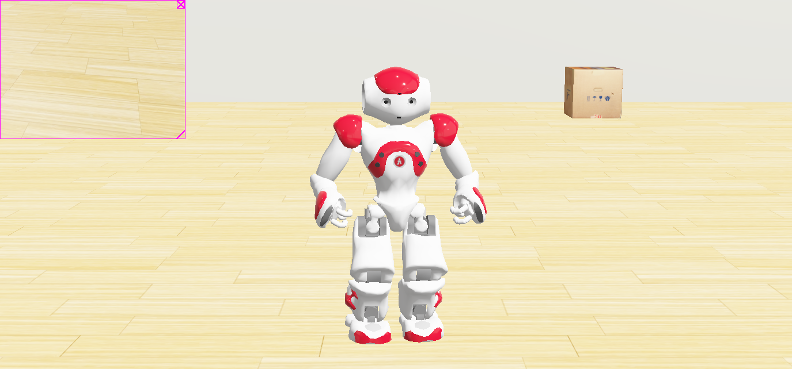

# 🤖 NAO Robot Web Control System

Full-stack web application for controlling a NAO humanoid robot in Webots simulation through an intuitive web interface.



## 🎯 Features

- **Modern Web Interface** - Control NAO robot from your browser
- **Real-time Updates** - WebSocket-based live status updates
- **Gesture Control** - Wave, point, and standing poses
- **Head Movement** - Up, down, left, right controls
- **Walking Movements** - Forward, backward, turning
- **RESTful API** - Complete API for robot control
- **Responsive Design** - Works on desktop and mobile

## 🏗️ Architecture

```
Frontend (Next.js + React)  →  Backend (FastAPI)  →  Webots Simulator
    Port 3000                    Port 8000/10020        NAO Robot

         ↓                            ↓                      ↓
    User Interface          REST API + WebSocket      Physics Simulation
```

### Technology Stack

- **Frontend**: Next.js 15, React 18, TypeScript, Tailwind CSS
- **Backend**: Python FastAPI, WebSockets, Pydantic
- **Simulation**: Webots R2023b, NAO Robot Model
- **Communication**: REST API, WebSocket, TCP Sockets

## 📁 Project Structure

```
klarix-humanoid-bot/
├── frontend/                   # Next.js React application
│   ├── app/                   # Next.js app directory
│   │   ├── page.tsx          # Home page
│   │   ├── layout.tsx        # Root layout
│   │   └── globals.css       # Global styles
│   ├── components/           # React components
│   │   └── RobotControl.tsx  # Main control interface
│   └── package.json          # Frontend dependencies
│
├── backend/                   # FastAPI backend
│   ├── app/
│   │   ├── main.py           # FastAPI application
│   │   ├── api/
│   │   │   └── robot.py      # API endpoints
│   │   ├── models/
│   │   │   └── robot.py      # Pydantic models
│   │   └── services/
│   │       ├── robot_controller.py   # Robot control logic
│   │       └── webots_bridge.py      # Webots communication
│   └── requirements.txt      # Python dependencies
│
├── webots/                    # Webots simulation
│   ├── worlds/
│   │   └── nao_office_demo.wbt      # Office environment
│   └── controllers/
│       └── nao_office_assistant/
│           ├── nao_office_assistant.py   # Main controller
│           └── backend_client.py          # Backend communication
│
├── README.md                  # This file
├── CLAUDE.md                  # AI assistant context
└── .gitignore                 # Git ignore rules
```

## 🚀 Quick Start

### Prerequisites

- **Webots R2023b** - [Download](https://github.com/cyberbotics/webots/releases/tag/R2023b)
- **Python 3.8+** - For backend
- **Node.js 18+** - For frontend

### Installation

**1. Clone Repository**
```bash
git clone https://github.com/Gokulnathnallaiya/klarix-humanoid-bot.git
cd klarix-humanoid-bot
```

**2. Install Backend Dependencies**
```bash
cd backend
pip install -r requirements.txt
```

**3. Install Frontend Dependencies**
```bash
cd frontend
npm install
```

### Running the Application

**IMPORTANT: Start services in this order:**

#### Terminal 1: Backend Server
```bash
cd backend
python -m app.main
```

Wait for:
```
✓ Webots bridge listening on localhost:10020
✓ Backend ready - Waiting for Webots controller connection...
```

#### Terminal 2: Webots Simulation
```bash
webots webots/worlds/nao_office_demo.wbt
```

Wait for:
```
✓ Connected to backend at localhost:10020
✓ Ready to receive commands from web interface!
```

#### Terminal 3: Frontend (Optional - for UI)
```bash
cd frontend
npm run dev
```

### Access Points

- **Web Interface**: http://localhost:3000
- **API Documentation**: http://localhost:8000/docs
- **API Health Check**: http://localhost:8000/health

## 🎮 Usage

### Web Interface

1. Open http://localhost:3000 in your browser
2. Verify both indicators are green (Backend + Robot)
3. Click control buttons:
   - **Purple buttons**: Gestures (Wave, Point, Stand)
   - **Blue buttons**: Head movements
   - **Green buttons**: Walking movements

### API Usage

**Gesture Control:**
```bash
curl -X POST http://localhost:8000/api/robot/gesture \
  -H "Content-Type: application/json" \
  -d '{"gesture": "wave"}'
```

**Head Movement:**
```bash
curl -X POST http://localhost:8000/api/robot/head/move \
  -H "Content-Type: application/json" \
  -d '{"direction": "left"}'
```

**Walking:**
```bash
curl -X POST http://localhost:8000/api/robot/walk \
  -H "Content-Type: application/json" \
  -d '{"movement": "forward", "duration": 2.0}'
```

**Get Status:**
```bash
curl http://localhost:8000/api/robot/status
```

### WebSocket Real-time Updates

```javascript
const ws = new WebSocket('ws://localhost:8000/api/robot/ws');

ws.onmessage = (event) => {
  const status = JSON.parse(event.data);
  console.log('Robot status:', status);
};
```

## 🔧 API Reference

### REST Endpoints

| Method | Endpoint | Description |
|--------|----------|-------------|
| POST | `/api/robot/gesture` | Execute gesture (wave, point, stand) |
| POST | `/api/robot/head/move` | Move head (up, down, left, right) |
| POST | `/api/robot/walk` | Walk (forward, backward, turn_left, turn_right) |
| POST | `/api/robot/motor` | Set single motor position |
| POST | `/api/robot/motors` | Set multiple motor positions |
| GET | `/api/robot/status` | Get current robot status |
| POST | `/api/robot/connect` | Connect to robot |
| POST | `/api/robot/disconnect` | Disconnect from robot |

### WebSocket

- **Endpoint**: `ws://localhost:8000/api/robot/ws`
- **Purpose**: Real-time status updates
- **Message Format**: JSON

## 🛠️ Troubleshooting

### Backend won't start
```bash
# Check if ports are in use
lsof -i :8000
lsof -i :10020

# Kill processes using these ports
kill -9 <PID>
```

### Webots controller can't connect
- ✅ Ensure backend started **before** Webots
- ✅ Check backend shows "Waiting for Webots controller connection..."
- ✅ Restart Webots simulation (`Ctrl+Shift+R`)

### Frontend shows "Backend not connected"
- ✅ Backend must be running on port 8000
- ✅ Check: http://localhost:8000/docs
- ✅ Look for CORS errors in browser console

### Robot doesn't move
- ✅ Check Webots console for connection message
- ✅ Verify both green indicators in web UI
- ✅ Check backend terminal for command logs

## 🧪 Development

### Adding New Gestures

**Backend** (`backend/app/services/robot_controller.py`):
```python
async def new_gesture(self, gesture_name: str) -> Dict:
    command = {"type": "gesture", "gesture": gesture_name}
    return await self.webots_bridge.send_command(command)
```

**Webots Controller** (`webots/controllers/nao_office_assistant/nao_office_assistant.py`):
```python
def new_gesture():
    motors['RShoulderPitch'].setVelocity(3.0)
    motors['RShoulderPitch'].setPosition(0.5)
    # Add motor commands...
```

**Frontend** (`frontend/components/RobotControl.tsx`):
```typescript
const newGesture = {
  name: 'New Gesture',
  value: 'new_gesture',
  icon: IconName,
  color: 'bg-purple-500 hover:bg-purple-600'
};
```

## 📊 Communication Flow

```
1. User clicks "Wave" button
   ↓
2. Frontend → POST http://localhost:8000/api/robot/gesture
   ↓
3. Backend receives REST request
   ↓
4. Backend → TCP Socket (port 10020) → Webots Controller
   ↓
5. Webots Controller executes motor commands
   ↓
6. NAO Robot moves in simulation
   ↓
7. Webots Controller → Status → Backend
   ↓
8. Backend → WebSocket → Frontend
   ↓
9. Frontend updates UI in real-time
```

## 🤝 Contributing

1. Fork the repository
2. Create a feature branch (`git checkout -b feature/amazing-feature`)
3. Commit your changes (`git commit -m 'Add amazing feature'`)
4. Push to the branch (`git push origin feature/amazing-feature`)
5. Open a Pull Request

## 📝 License

This project is open source and available under the MIT License.

## 🙏 Acknowledgments

- **Webots** - Robot simulation software by Cyberbotics
- **NAO Robot** - Humanoid robot by SoftBank Robotics
- **FastAPI** - Modern web framework for Python
- **Next.js** - React framework for production

## 📧 Contact

- **Repository**: https://github.com/Gokulnathnallaiya/klarix-humanoid-bot
- **Issues**: https://github.com/Gokulnathnallaiya/klarix-humanoid-bot/issues

## 🎓 Learning Resources

- [Webots Documentation](https://cyberbotics.com/doc/guide/index)
- [NAO Robot Documentation](https://cyberbotics.com/doc/guide/nao)
- [FastAPI Documentation](https://fastapi.tiangolo.com/)
- [Next.js Documentation](https://nextjs.org/docs)

---

**Made with ❤️ for robotics education and research**
